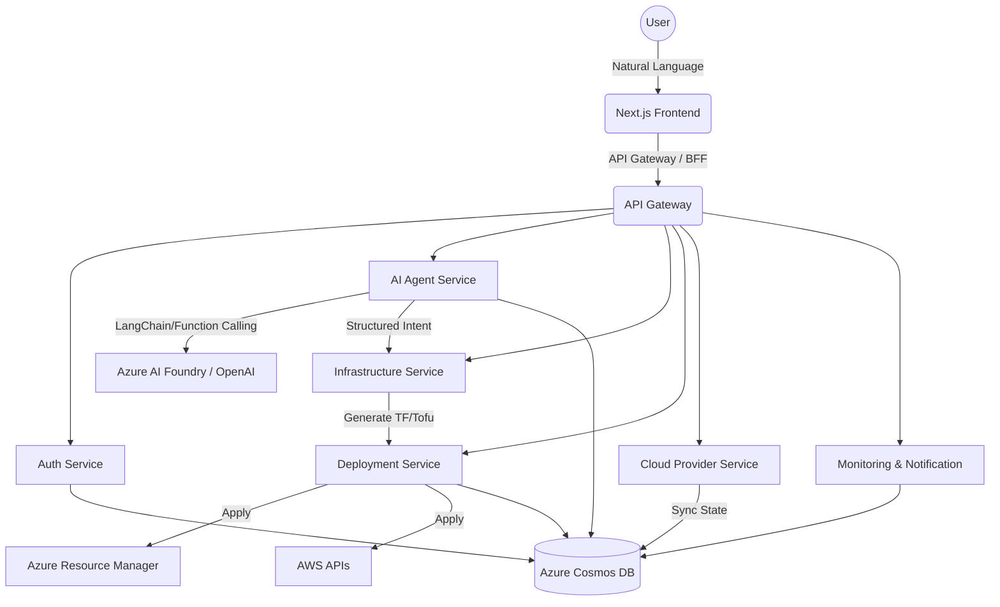
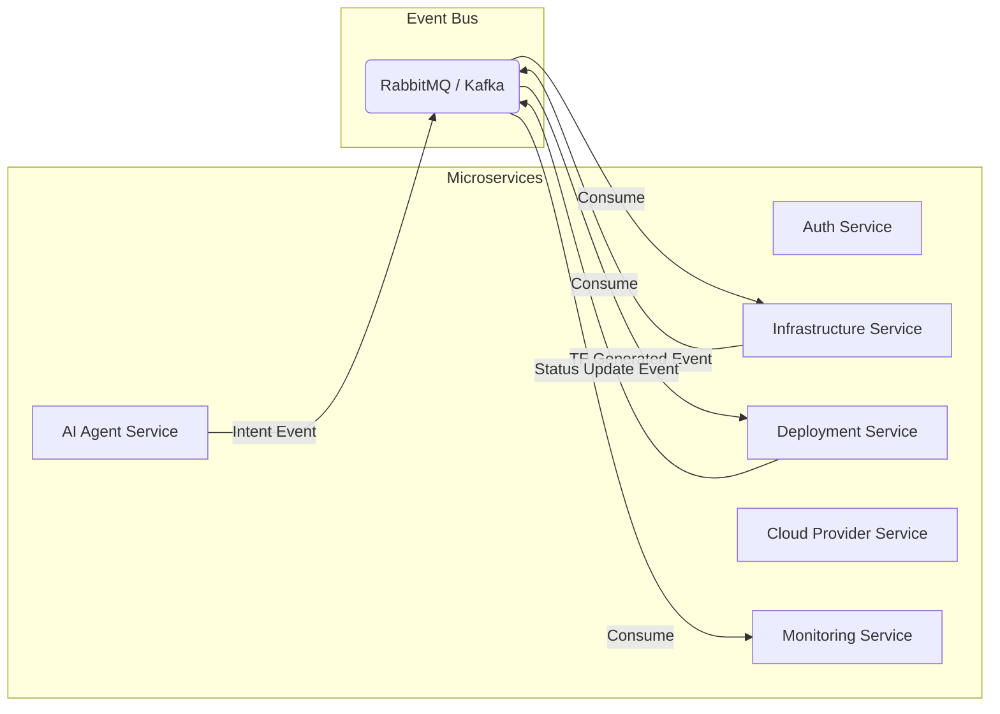
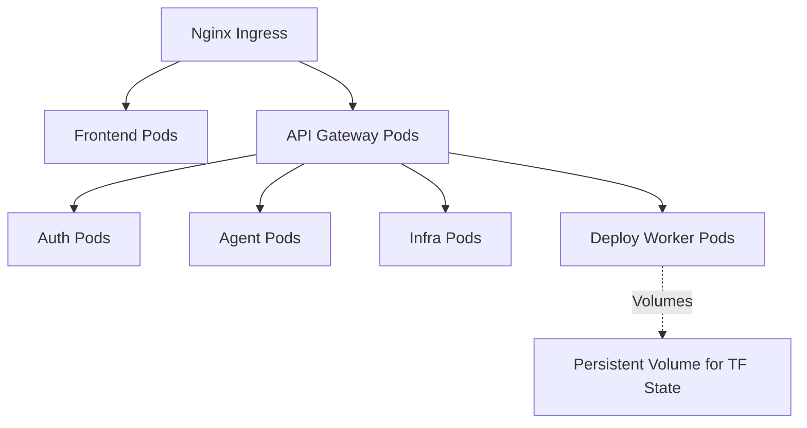
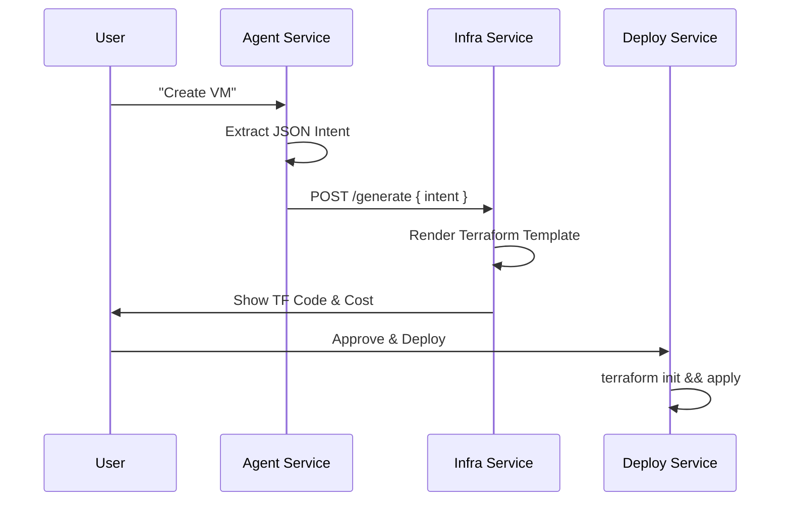
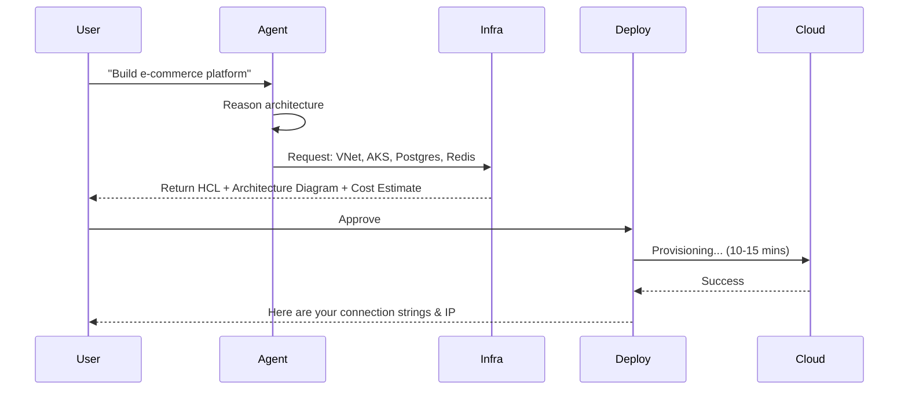

# CloudPilot AI: Enterprise Blueprint

## 1. System Architecture Diagram



## 2. High Level Design (HLD)

The CloudPilot AI platform is designed using a microservices architecture to ensure high availability, scalability, and loose coupling.
- **Frontend**: A React/Next.js SPA handling chat interfaces, dashboards, and authentication.
- **API Gateway**: Routes requests, handles rate limiting, and standardizes authentication headers.
- **Core Microservices**: Isolated domains (Auth, AI, Infra, Deployment, Cloud Sync) communicating asynchronously via event buses (e.g., Kafka or RabbitMQ) for long-running infrastructure tasks.
- **State Store**: Azure Cosmos DB serves as the highly distributed NoSQL datastore for user profiles, generated configurations, deployment states, and chat histories.

## 3. Low Level Design (LLD)

- **AI Agent Service**: 
  - Exposes an endpoint `/api/v1/chat`.
  - Maintains conversation context.
  - Formats system prompts and tools schema for Azure AI Foundry.
  - Parses LLM JSON responses to extract `action`, `provider`, and resource parameters.
- **Infrastructure Service**: 
  - Receives the JSON intent.
  - Loads Handlebars or Go-templates for Terraform.
  - Compiles the template with the provided parameters.
  - Returns the generated HCL (HashiCorp Configuration Language) string.
- **Deployment Service**:
  - Receives the HCL string.
  - Spawns a worker process running the Terraform CLI.
  - Captures `stdout`/`stderr` and streams it back to the database and frontend via WebSockets.

## 4. Microservice Architecture



## 5. Cosmos DB Data Model

Cosmos DB uses a NoSQL document model. Below are the core schemas:

**`users` Collection**
```json
{
  "id": "uuid",
  "email": "user@company.com",
  "role": "admin|user",
  "organization_id": "uuid"
}
```

**`conversations` Collection**
```json
{
  "id": "uuid",
  "user_id": "uuid",
  "messages": [
    {"role": "user", "content": "Create an Ubuntu VM"},
    {"role": "assistant", "content": "Sure, which region?"}
  ],
  "extracted_intent": {
     "action": "create_vm",
     "provider": "azure"
  }
}
```

**`deployments` Collection**
```json
{
  "id": "uuid",
  "user_id": "uuid",
  "status": "pending|planning|applying|success|failed",
  "terraform_code": "...",
  "logs": "...",
  "cloud_provider": "azure"
}
```

## 6. API Specifications (RESTful)

- `POST /api/auth/login` -> JWT Token
- `POST /api/agent/chat`
  - Body: `{ "message": "Create a VNet", "conversation_id": "..." }`
  - Response: Streamed text or JSON tool call extraction.
- `GET /api/deployments/:id`
  - Response: Deployment status and real-time logs.
- `POST /api/cloud/sync`
  - Triggers a discovery job to sync existing cloud resources into the DB.

## 7. Folder Structure (Monorepo approach)

```text
cloudpilot-ai/
├── frontend/
│   ├── src/
│   │   ├── app/           # Next.js app router
│   │   ├── components/    # UI elements (Chat, Dashboard)
│   │   └── lib/           # API clients
├── services/
│   ├── auth-service/
│   ├── agent-service/     # Python or Node (Langchain/AI logic)
│   ├── infra-service/     # Go or Node (Terraform templates)
│   ├── deploy-service/    # Go or Python (Terraform execution)
│   ├── provider-service/
│   └── monitor-service/
├── templates/             # Terraform/OpenTofu templates
├── docker-compose.yml
└── README.md
```

## 8. Kubernetes Deployment Architecture



## 9. AI Agent Design

The AI Agent acts as an orchestrator using the ReAct (Reasoning and Acting) pattern.
1. **System Prompt**: Defines the persona ("You are CloudPilot AI...") and strict JSON output rules.
2. **Context Retrieval**: Pulls the user's cloud account limits and existing resources from DB.
3. **Intent Recognition**: Maps user input to a specific cloud action.
4. **Parameter Extraction**: Uses Function Calling to extract `region`, `size`, `name`, etc.

## 10. Tool Calling Architecture

We define strict JSON schemas for tools provided to Azure AI Foundry.

```json
{
  "name": "create_vm",
  "description": "Creates a Virtual Machine in Azure or AWS",
  "parameters": {
    "type": "object",
    "properties": {
      "provider": { "type": "string", "enum": ["azure", "aws"] },
      "vm_name": { "type": "string" },
      "os": { "type": "string", "enum": ["ubuntu", "windows", "amazon-linux"] },
      "cpu": { "type": "integer" },
      "memory": { "type": "string" },
      "region": { "type": "string" }
    },
    "required": ["provider", "vm_name", "os", "region"]
  }
}
```

## 11. Terraform Generation Flow



## 12. Azure Resource Deployment Flow
1. User authenticates Azure via Service Principal (Client ID, Secret, Tenant).
2. Credentials securely injected into Deployment Worker as Env Vars (`ARM_CLIENT_ID`, etc.).
3. Terraform creates Resource Group -> VNet -> Subnet -> NIC -> VM.

## 13. AWS Resource Deployment Flow
1. User authenticates via AWS IAM User Access Keys or Assumed Role.
2. Credentials injected (`AWS_ACCESS_KEY_ID`, `AWS_SECRET_ACCESS_KEY`).
3. Terraform creates VPC -> IGW -> Subnet -> Route Table -> EC2.

## 14. Security Architecture
- **Data at Rest**: Cosmos DB encryption, secrets stored in Azure Key Vault or HashiCorp Vault.
- **Data in Transit**: TLS 1.2+ for all microservice communication.
- **Authentication**: JWT based, short-lived tokens.
- **RBAC**: Organization-level isolation. Users can only deploy to their organization's attached cloud accounts.

## 15. Production Deployment Strategy
- **Containerization**: All services Dockerized.
- **Orchestration**: Deployed to AKS (Azure Kubernetes Service) or EKS.
- **State Management**: Terraform state stored remotely in Azure Blob Storage or AWS S3 with state locking via DynamoDB.

## 16. CI/CD Design
- **Source Control**: GitHub / GitLab.
- **CI**: GitHub Actions to run linting, unit tests, and build Docker images.
- **CD**: ArgoCD for GitOps based deployment to the Kubernetes cluster.

## 17. Complete Development Roadmap
- **Phase 1 (MVP)**: Basic Chat UI, Azure AI Foundry integration, simple VM/VPC creation.
- **Phase 2**: Multi-cloud support (AWS), cost estimation engine, Terraform plan approval UI.
- **Phase 3**: Complex architectures (EKS/AKS), CI/CD integrations, Audit logging.
- **Phase 4**: Enterprise RBAC, SOC2 compliance features, advanced auto-healing.

## 18. Sequence Diagrams (Advanced App Deployment)



## 19. Multi-Cloud Resource Mapping Matrix

| Abstraction | Azure | AWS |
| :--- | :--- | :--- |
| Compute | Virtual Machine | EC2 |
| Managed K8s | AKS | EKS |
| Networking | VNet | VPC |
| Sub-network | Subnet | Subnet |
| Relational DB | Azure DB for PostgreSQL | RDS PostgreSQL |
| NoSQL DB | Cosmos DB | DynamoDB |
| Object Storage | Storage Account | S3 |
| PaaS Web App | App Service | Elastic Beanstalk |

## 20. Production-Ready Enterprise Best Practices
- **Idempotency**: All AI-generated code must be strictly declarative (Terraform).
- **Least Privilege**: Deployment roles should only have permissions for explicitly requested resources.
- **Auditability**: Every deployment and prompt is logged in Cosmos DB for compliance.
- **Timeouts**: Hard timeouts on Deployment Service workers to prevent hung processes.
- **Drift Detection**: Scheduled jobs run `terraform plan` to detect if users manually changed cloud resources outside the platform.
